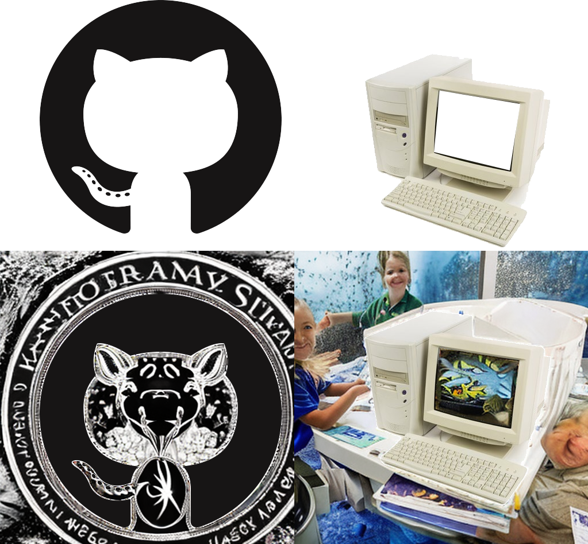
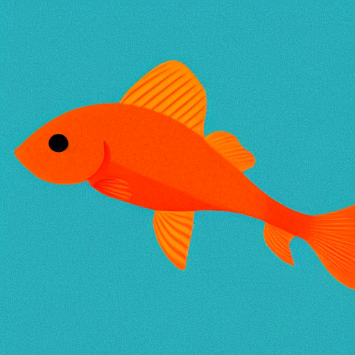

# hello there 🐠

this is a completely vanilla javascript and html canvas outpainting convenience doodad built for the API optionally exposed by [AUTOMATIC1111's stable diffusion webUI](https://github.com/AUTOMATIC1111/stable-diffusion-webui), operating similarly to a few others which certainly have superior functionality.  this simply offers an alternative for my following vain desires:
 - avoiding the overhead of an additional virtual python evnironment or impacting a pre-existing one
 - operates against the API exposed by A1111's webUI
 - no external dependencies, extremely boring vanilla
 - no external connectivity, self-hosted and offline
 - unobfuscated (cough cough)
 - i am terrible at javascript and should probably correct that
 - i have never used html canvas for anything before and should try it out

 ## features
  - a big ol' 2560x1440 canvas for you to paint all over _(infinite canvas area planned, in //todo already)_
  - inpainting/touchup blob
  - easily change samplers/steps/CFG/etc options for each dream summoned from the latent void 
  - optional right-click to erase output image under cursor
  - optional grid snapping for precision
  - optional overmasking for potentially better seams between outpaints and it _sorta_ works currently but it needs fixing
  - optional hi-res fix for blank/txt2img dreams which, if enabled, uses image width/height / 2 as firstpass size
  - import arbitrary images and superimpose on the canvas wherever you'd like ([extra fun with transparent .pngs!](#arbitrary_transparent)) 
  - "temporary" monitors at the bottom to see exactly what mask/image you're feeding img2img, no i'm certainly not using them as actual imagedata sources or anything
  - saves your preferences to browser localstorage for maximum convenience

 ## operation

 ### prerequisities
 you'll obviously need A1111's webUI installed before you can use this, thus you're presumed to have an operational python install up and running to boot.  

 ### notes 
 -  technically you can run it directly in browser as a bare `file://` protocol webpage but that's _really_ not recommended as you'll have to add `null` as an accepted domain to your `--cors-allow-origins` option which just seems like it's a visibly poor decision 
 - a deliciously simple launch script is included to pop up a teensy tiny python-based local webserver, however you may have to manually `chmod +x openOutpaint.sh` on mac/linux 
 - the address http://127.0.0.1:3456 will be used as the host address for openOutpaint in the below quickstart; your local setup may use a different IP address or port.  you can of course modify the included launch script to point at a different port than 3456 if desired, as well
 - if your scale factor is > 8 (generating an image larger than 512x512), try the "auto txt2img HR fix" option

### quickstart speedrun
1. edit your `cors-allow-origins` to include https://zero01101.github.io and run webUI
2. go to https://zero01101.github.io/openOutpaint/ and fill in the host value with your webUI API address
3. click things and do stuff

### quickstart normal edition
 1. clone this repo to your homelab's webserver (i mean who doesn't have a couple of those lying around?) or somewhere on your local pc
 2. modify your `webui-user.sh` or `webui-user.bat`'s `COMMANDLINE_ARGS` variable to contain ` --api --cors-allow-origins=http://127.0.0.1:3456` 
 3. execute your webui-user script and wait for it to be ready
 4. **APPLY THE FOLLOWING SETTINGS IN A1111 WEBUI ONCE IT IS READY:** 
  - select an inpainting checkpoint/model - ([runwayml/stable-diffusion-inpainting](https://huggingface.co/runwayml/stable-diffusion-inpainting) [3e16efc8] is recommended)
  - set your `Inpainting conditioning mask strength` to `1`
  - disable the `Apply color correction to img2img results to match original colors.` option (the last 2 options are found under the stable diffusion category in the settings tab by default unless you've already moved it to your quicksettings list, and if so, you know where to set them already)
 5. configure your local webhost in your homelab to serve the newly cloned repo like the technological bastion you are, or simply run the included `openOutpaint.bat` on windows or `openOutpaint.sh` on mac/linux. 
 6. open your locally-hosted web server at http://127.0.0.1:3456 (or wherever, i'm not your boss)
 7. update the host field if necessary to point at your stable diffusion API address, change my stupid prompts with whatever you want, click somewhere in the canvas, and wait _OR_ you can load an existing image from your computer using the file selector browse button under "load local image"
 8. once an image appears*, click the `<` and `>` buttons at the bottom-left corner of the image to cycle through the others in the batch if you requested multiple (it defaults to 2 batch size, 2 batch count) - click `y` to choose one you like, or `n` to cancel that image generation batch outright and possibly try again
 9. now that you've got a starter, click somewhere near it to outpaint - try and include as much of the "context" as possible in the reticle for the best result convergence
 10. enable the mask mode to prepare previously rendered imagery for touchups/inpainting, then paint over the objectionable region; once your masked region is drawn, disable mask mode and change your prompt if necessary, then click over the canvas containing the mask you just painted to request the refined image(s)
 11. play around with the available options!  
  - snap to grid, uh, snaps to the grid
  - mask mode is practically identical to A1111's inpainting mask, except that...
  - scale factor affects the size of both the painting reticle __and__ mask blob 
  - overmask and related px value expands the area masked in img2img outpaint requests, so as to attempt to minimize the seam between images; it's _partially_ functional currently and correcting the flaws are already in the //todo and issue tracker
  - ...everything else is pretty much just a regular stable diffusion option so i presume you know how you use those
 12. click "save canvas" to save the cropped region of outpainted canvas 
 13. click "clear canvas" to blank the canvas and start all over only to discover that it's like 2 AM and you have to go to sleep because you have work in about 4 hours 

*if it _doesn't_ create an image, check your console output to see if you've got CORS errors 

## //todo
### in order of "priority"/likelihood of me doing it
- [ ] lots and lots of readme updates (ongoing)
- [ ] comment basically everything that isn't self documenting (ongoing)
- [ ] CHORE: refactor all the duplicated JS code (ongoing, guaranteed to get worse before it gets better)
- [x] overmask seam of img2img - BUG: it kinda sucks currently, just moves the seam instead of fixing it, i want to try to gradient-fade the edge but filter = 'blur(Ypx)' is _awful_ for this and my remedial per-pixel loops crash the browser because i am the embodiment of inefficiency
- [x] split out CSS to its own file (remedial cleanup task)
- [x] ability to blank/new canvas without making the user refresh the page because that's pretty janky
- [ ] add error handling for async/XHR POST in case of, yknow, errors
- [x] image erase region in case you decide later that you're not too happy with earlier results (technically i guess you could just mask over the entire region you dislike but that's... bad)
- [ ] controls for the rest of API-available options (e.g. ~~hires fix~~, inpaint fill modes, etc)
- [x] ~~save user-set option values to browser localstorage to persist your preferred, uh, preferences~~ 
- [ ] render progress spinner/bar
- [x] ~~smart crop downloaded image~~ 
- [x] import external image and ~~scale/~~ superimpose at will on canvas for in/outpainting
- [ ] scaling of imported arbitrary image before superimposition
- [ ] "numpad" selector for determining how reticle is anchored against actual mouse cursor (currently works like a "5" [center] on the "numpad" paradigm)
- [ ] discrete size control for mask and target reticle, discrete x/y axes for reticle
- [x] ~~floating/togglable menu leftnav bar with categorized/sensibly laid-out options~~ 
- [ ] infinite canvas
- [ ] global undo/redo
- [ ] inpainting sketch tools
- [ ] split out JS to separation-of-concerns individual files (oh no)
- [x] ~~something actually similar to a "user interface", preferably visually pleasant and would make my mom say "well that makes sense" if she looked at it~~
- [ ] eventually delete the generated mask display canvases at the bottom of the page, but they're useful for debugging canvas pixel offsets sometimes
- [ ] see if i can use fewer canvases overall; seems wasteful, canvas isn't free yknow
- [ ] upscaling output canvas??? sure let's make 16k wallpapers that'll be neat
- [ ] honestly probably refactor literally everything

## pull requests
**PLEASE SEND PULL REQUESTS**  
i am begging you, yes you personally reading this, please fix my horrible code and feel free to insult it, but i absolutely refuse to budge on no 3rd party libraries or dependencies, not even jquery, nothing.  vanilla is a very complex and layered flavor if you give it a chance.

## bug reports
please do! kindly indicate your OS, browser, versions of both, any errors in devtools/console output, what you were trying to do, what you expected, what happened unexpectedly or incorrectly, if something caught fire (please call the fire department first), the usual

## known bugs :(
 - generated images display +1px on x/y during approve/reject state, doesn't affect output, just annoying
 - erase mask is like entirely broken
 - ~~odd-numbered scale factors don't snap correctly~~
 - ~~arbitrary "pasted" images require clicking twice to place them and i _don't know why_ [(yes i do)](#terrible), just getting them to be arbitrarily placable was a giant pain because i'm not got the smarts~~
 - selecting an aribtrary image by double-clicking it in the file picker can sometimes trigger a dream request that errors out if your file picker is "above" the canvas; i tried to alleviate that by temporarily removing the mouse(move/down/up) handlers for the canvas context on selection of a file, but i'm POSITIVE it's an improper solution and not quite sure if it's even fully effective
 - not sure if "bug" since it occurs in stable diffusion and not openOutpaint, but auto txt2img HRfix + odd number scale factors returns an "Exception in ASGI application" in SD console output; for example using scale factor of 9 results in "RuntimeError: Sizes of tensors must match except in dimension 1. Expected size 10 but got size 9 for tensor number 1 in the list." 

## warranty
[lmao](https://github.com/moyix/fauxpilot#support-and-warranty)

## samples 
generated using 100% openOutpaint UI defaults except for switching to/from mask mode and changing scale factor to adjust the size of the mask blob, there's some neat stuff down there even if it disregarded the `people, humans, divers` negative prompt but in its defense there is only one singular person, human, diver in there, so according to the no homers club treatise of 1995 it's technically correct 

_(see https://github.com/zero01101/openOutpaint/commit/92ab9d231542ea5f7a3c85563acf5cd3cb16a928 for attempted counterattack)_

simple transparent PNGs slapped on the canvas twice and default UI settings used on the southern half 

imported a transparent clip of a [relatively famous happy lil kitty](https://commons.wikimedia.org/wiki/File:So_happy_smiling_cat.jpg), used default openOutpaint settings except changing the prompt to "a cat on a space station", eventually received this magnificent vision

## version history
- 0.0.1 - txt2img proof of concept
- 0.0.2 - img2img outpainting proof of concept
- 0.0.3 - image masking/img2img inpainting proof of concept
- 0.0.4 - batch size/batch count, approve/reject system implementations, snap-to-grid, other people are now allowed to see this thing [01f8c6a](https://github.com/zero01101/openOutpaint/commit/01f8c6ab3f49739439a0990d6f5f0967a9a0bf12)
- 0.0.4.1 - extremely minor revisions [02cb01a](https://github.com/zero01101/openOutpaint/commit/02cb01ac062ef93878ff4161eabcedfa8e125be6)
- 0.0.4.2 - pull requests (&lt;3), downloaded images now have a timestamped name, css breakout because hopefully this will become halfway attractive enough to benefit from non-inline stylesheets [70ad4fe](https://github.com/zero01101/openOutpaint/commit/70ad4fe081bdbd507afc5af3cc2a4435924b66e3)
- 0.0.4.3 - overmasking, settings saved to localstorage [fca2e01](https://github.com/zero01101/openOutpaint/commit/fca2e01b8a4ecfe3d062c4090d5886e1033e8f38)
- 0.0.5 - import arbitrary image from user's machine, "auto" txt2img hires fix, Very Important "new image" button [3b7f4e3](https://github.com/zero01101/openOutpaint/commit/3b7f4e3759d0d1f3b38eba7249e5b58bc8162c75)
- 0.0.5.1 - erase rendered imagery with right click, ensure webUI is running (thanks again [@Kalekki](https://github.com/Kalekki)! (https://github.com/zero01101/openOutpaint/pull/7)) [54577d4](https://github.com/zero01101/openOutpaint/commit/54577d4f15fd7d014aaf2471e0042b3c48735e9c)
- 0.0.5.5 - highly attractive and functional floating control panel which will be extremely useful for infinite canvas, [@Kalekki](https://github.com/Kalekki) is literally the best ([11](https://github.com/zero01101/openOutpaint/pull/11)) [dac188d](https://github.com/zero01101/openOutpaint/commit/dac188dbfb086d3063f14b1a6a6a5b3add1aa5f5)
- 0.0.5.6 - _FINALLY_ the sliders update their values in realtime, a nice overall start on cleaning up my mess (thanks [@seijihariki](https://github.com/seijihariki)!) ([14](https://github.com/zero01101/openOutpaint/pull/14)) [d9fb87a](https://github.com/zero01101/openOutpaint/commit/d9fb87acec6653f19a9dac7777bd866782303ebc)

## collaborator credits 👑
 - [@jasonmhead](https://github.com/jasonmhead) - [the most minimal launch script](https://github.com/zero01101/openOutpaint/pull/1)
 - [@Kalekki](https://github.com/Kalekki) - all SORTS of awesome goodness, legit pull request hero: [what i was calling "smart crop"](https://github.com/zero01101/openOutpaint/pull/2),[localstorage](https://github.com/zero01101/openOutpaint/pull/5), [delightful floating UI](https://github.com/zero01101/openOutpaint/pull/11)
 - [@lifeh2o](https://www.reddit.com/user/lifeh2o/overview) ([a](https://www.reddit.com/r/StableDiffusion/comments/ywf8np/i_made_a_completely_local_offline_opensource/iwl6s06/),[b](https://www.reddit.com/r/StableDiffusion/comments/ys9lhq/kollai_an_infinite_multiuser_canvas_running_on/ivzygwk/?context=3)) - overmasking concept that is still driving me crazy getting it to work right

## what's with the fish?
deep aquatic life is _fascinating_ so i went with something underwater for a default prompt which led to making an _"illustration of a bright orange fish, plain blue solid background"_ favicon which led to "ok then, fish is mascot" 

~~the end~~ _𝒻𝒾𝓃_ 🐠
